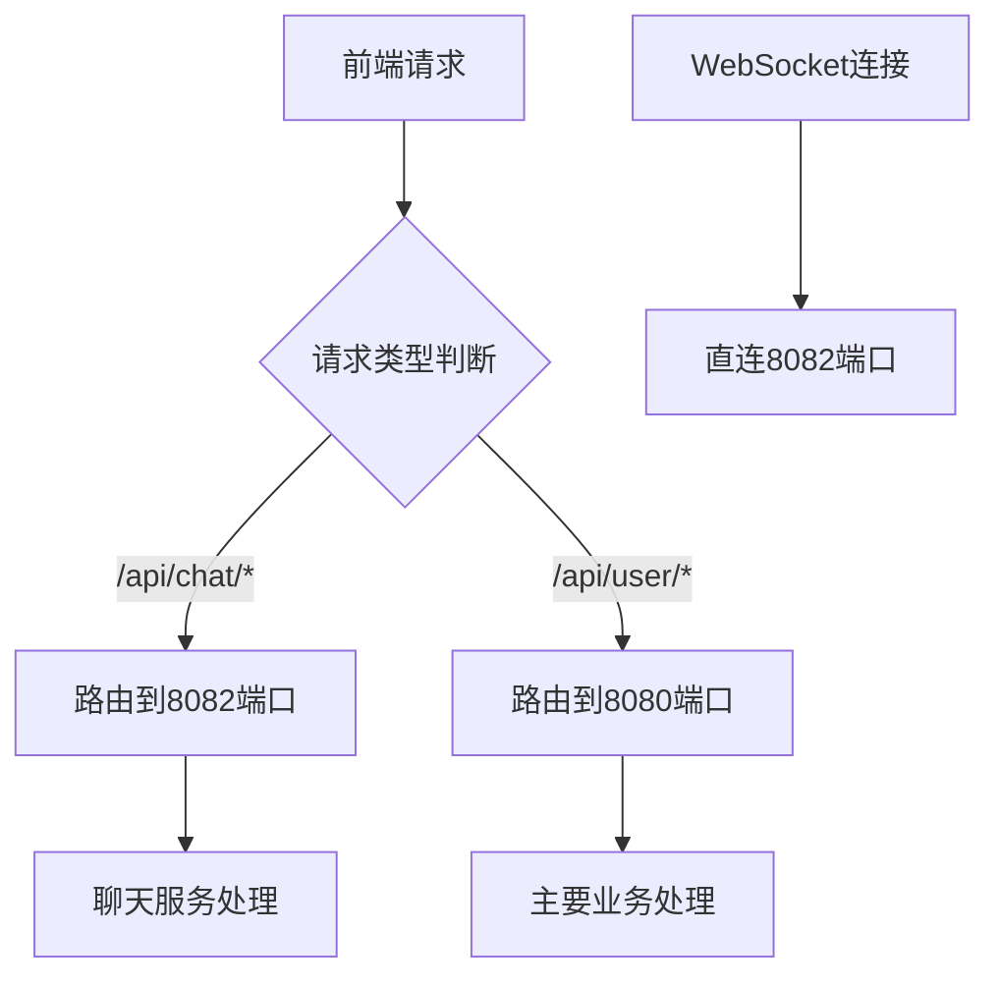

# 🔧 聊天服务端口配置 - 8082 端口

## 📋 更新概述

已将所有聊天相关的请求配置为发送到 **8082 端口**，与主要业务服务（8080端口）分离。

## 🏗️ 架构设计

### 服务端口分离
```
┌─────────────────┬─────────────────┬─────────────────┐
│   服务类型      │     端口        │      用途       │
├─────────────────┼─────────────────┼─────────────────┤
│   主要业务      │     8080        │ 用户、笔记、论坛 │
│   聊天服务      │     8082        │ WebSocket、聊天  │
└─────────────────┴─────────────────┴─────────────────┘
```

### 请求路由规则
- **8080端口**: `/api/user/*`, `/api/notes/*`, `/api/posts/*`
- **8082端口**: `/api/chat/*`, WebSocket连接

## 📁 更新的文件

### 核心配置文件
- `src/config/chatConfig.ts` - **新增** 聊天系统配置中心
- `src/utils/websocket.ts` - WebSocket URL 更新为 8082 端口
- `src/utils/chatRequest.ts` - **新增** 专用聊天API请求工具
- `src/plugins/globalRequest.ts` - 请求拦截器支持端口路由

### 测试文件
- `public/websocket-token-test.html` - 测试页面端口更新

## 🔧 技术实现

### 1. 配置中心化
```typescript
// src/config/chatConfig.ts
export const CHAT_CONFIG = {
  MAIN_SERVER_PORT: 8080,    // 主要业务
  CHAT_SERVER_PORT: 8082,    // 聊天服务
  HOST: 'localhost',
};

export const buildUrl = {
  mainApi: (path) => `http://localhost:8080${path}`,
  chatApi: (path) => `http://localhost:8082${path}`,
  webSocket: (path) => `ws://localhost:8082${path}`,
};
```

### 2. 专用聊天请求工具
```typescript
// src/utils/chatRequest.ts
const chatRequest = extend({
  prefix: 'http://localhost:8082',  // 聊天服务专用
  credentials: 'include',
});

export const chatApi = {
  getChatRooms: () => chatRequest('/api/chat/rooms'),
  sendMessage: (roomId, content) => chatRequest('/api/chat/messages'),
  // ... 更多聊天API
};
```

### 3. 智能请求路由
```typescript
// src/plugins/globalRequest.ts
request.interceptors.request.use((url, options) => {
  // 聊天请求自动路由到8082端口
  if (url.includes('/api/chat/')) {
    const chatUrl = url.replace(/^(https?:\/\/[^\/]+)?/, 'http://localhost:8082');
    return { url: chatUrl, options };
  }
  return { url, options };
});
```

### 4. WebSocket连接更新
```typescript
// src/utils/websocket.ts
const WS_URL = buildUrl.webSocket('/chat'); // ws://localhost:8082/chat
```

## 🌐 服务端点映射

### 主要业务服务 (8080)
```
http://localhost:8080/api/user/login      # 用户登录
http://localhost:8080/api/user/register   # 用户注册
http://localhost:8080/api/notes/*         # 笔记相关
http://localhost:8080/api/posts/*         # 论坛相关
```

### 聊天服务 (8082)
```
http://localhost:8082/api/chat/rooms      # 聊天室列表
http://localhost:8082/api/chat/messages   # 发送消息
http://localhost:8082/api/chat/user       # 聊天用户信息
ws://localhost:8082/chat?token=xxx        # WebSocket连接
```

## 🚀 使用方法

### 1. 前端开发
所有聊天相关的API调用会自动路由到8082端口：

```typescript
// 使用专用聊天API
import { chatApi } from '@/utils/chatRequest';

// 获取聊天室列表
const rooms = await chatApi.getChatRooms();

// 发送消息
await chatApi.sendMessage('room1', 'Hello World');
```

### 2. WebSocket连接
```typescript
// 自动连接到8082端口
const ws = new WebSocket('ws://localhost:8082/chat?token=your_token');
```

### 3. 后端配置要求
确保后端服务正确配置：

```yaml
# 主要业务服务
server:
  port: 8080
  services: [user, notes, posts]

# 聊天服务
chat-server:
  port: 8082
  services: [websocket, chat-api]
```

## 🔍 调试和测试

### 1. 端口检查
```bash
# 检查服务是否在正确端口运行
netstat -an | grep 8080  # 主要业务
netstat -an | grep 8082  # 聊天服务
```

### 2. 请求验证
浏览器开发者工具中检查：
- 用户登录请求 → `localhost:8080`
- 聊天API请求 → `localhost:8082`
- WebSocket连接 → `ws://localhost:8082`

### 3. 测试页面
访问 `/websocket-token-test.html` 进行连接测试

## ⚠️ 注意事项

### 1. 跨端口Cookie
如果使用Cookie认证，注意跨端口的Cookie共享问题

### 2. CORS配置
确保8082端口的聊天服务支持来自8080端口前端的跨域请求

### 3. 负载均衡
生产环境中可能需要配置反向代理来统一入口

## 📊 请求流程图



---
