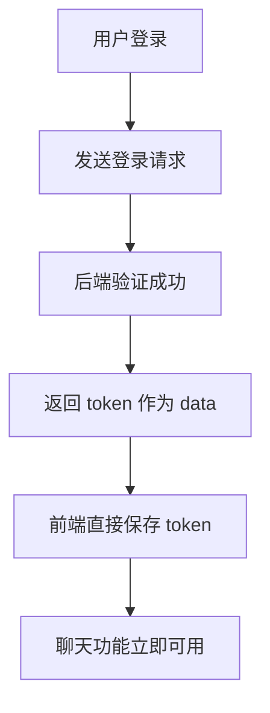
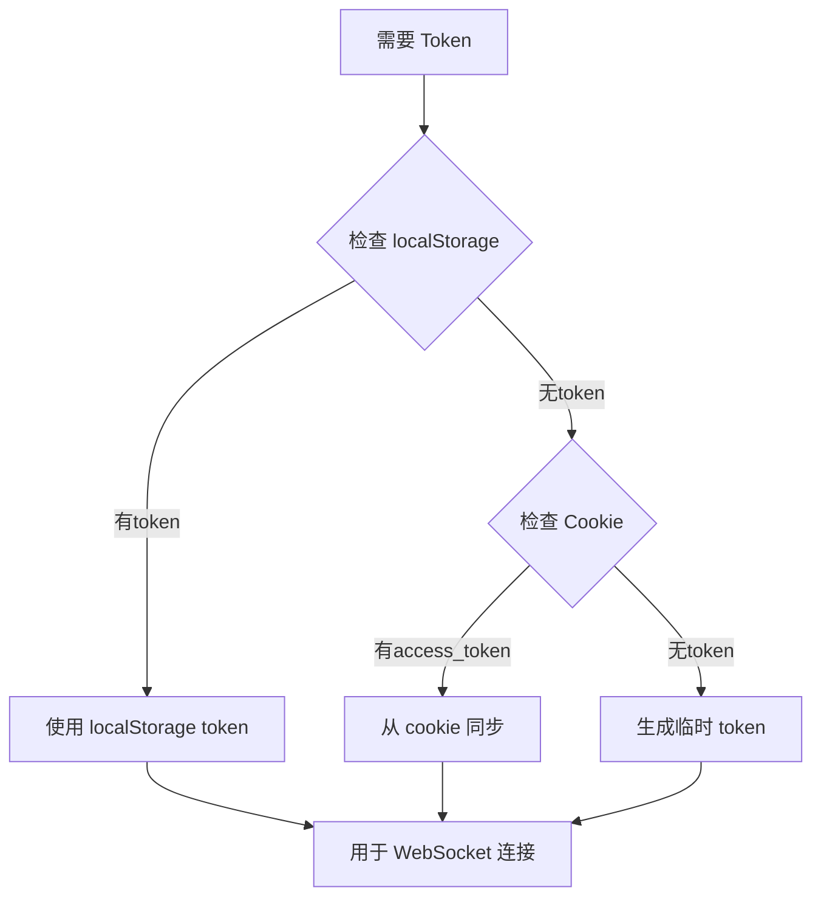

# 🔐 登录响应 Token 直接提取

## 🔧 技术实现

### 1. 登录流程更新

```typescript
// 登录成功后直接从响应中获取token
const response = await apiLogin({ ...values, type });

if (response) {
  // response 就是 token 字符串
  if (typeof response === 'string' && response.trim()) {
    localStorage.setItem('token', response);
    console.log('Token saved from login response:', response.substring(0, 20) + '***');
  }
}
```

### 2. Token 获取优先级

现在系统按以下优先级获取 token：

1. **登录响应** - 直接从登录 API 的 `data` 字段获取
2. **LocalStorage** - 已保存的 token
3. **Cookie** - `access_token` cookie（备用）
4. **临时生成** - 基于用户信息的临时 token（最后备选）

### 3. 避免重复保存

- **登录请求**：直接从响应 `data` 提取 token
- **其他请求**：仅在没有 localStorage token 时才从 cookie 同步
- **响应头**：如果有 `authorization` 或 `token` 头，优先使用

## 📁 更新的文件

### 主要修改
- `src/pages/user/Login/index.tsx` - 直接从登录响应提取 token
- `src/plugins/globalRequest.ts` - 避免登录时重复保存
- `src/utils/tokenManager.ts` - 清理代码，移除空 else 块

## 🚀 工作流程

### 登录时的 Token 处理


### Token 获取逻辑


## 🔍 调试验证

### 登录成功后检查
```javascript
// 在浏览器控制台查看
console.log('Login response token:', localStorage.getItem('token'));
```

### 预期日志输出
```
Token saved from login response: abcd1234567890123456***
```

## 📋 API 接口说明

### 登录接口响应格式
```json
{
  "code": 0,
  "data": "your_actual_token_string_here",
  "message": "登录成功"
}
```

### WebSocket 连接格式
```
ws://localhost:8080/chat?token=your_actual_token_string_here
```

## ✅ 验证步骤

1. **登录测试**：
   - 用户登录成功
   - 检查控制台是否有 "Token saved from login response" 日志
   - 验证 localStorage 中保存了正确的 token

2. **聊天功能**：
   - 登录后访问聊天页面
   - 系统自动检测到 token
   - WebSocket 连接成功建立

3. **Token 优先级**：
   - 登录响应的 token 优先级最高
   - 不会被 cookie 中的 access_token 覆盖
   - 确保使用最新的认证信息

## 🔧 配置要求

### 后端要求
- 登录成功后返回 token 字符串作为 `data` 字段
- WebSocket 服务端解析 URL 中的 token 参数
- Token 应具有足够的有效期和唯一性

### 前端行为
- 登录成功立即保存 token
- 自动用于 WebSocket 认证
- 退出时清除所有认证信息

---
